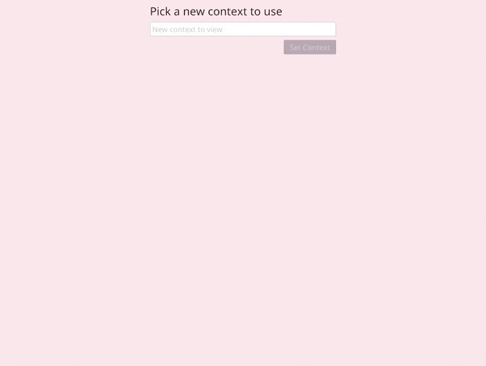

# iced-k8s

Simple cross-platform GUI Kubernetes cluster explorer implemented in Rust using
[iced](https://github.com/iced-rs/iced)
and
[kube](https://github.com/kube-rs/kube).

I used this project as a part of my journey learning Rust.

## Features

- Polls the cluster for changes so that the information is always up to date
- Shows deployments, pods, stateful sets, daemon sets, and replica sets for the currently configured Kubernetes context
    - View the phase of Pods
    - View the number of instances that are available for deployments and replication controllers
- Delete any of the resources that are listed
- Change Kubernetes contexts from any of the ones listed in your `~/.kube/config`
- Change namespaces
- If you open iced-k8s with an inaccessible cluster or namespace configured in your `~/.kube/config`,
   it will prompt you to select a different context or namespace

## Running

1. Install Rust using [rustup](https://rustup.rs/)
2. Clone this repo.
3. Run `cargo run` in the repo

## Demo

*In this demo, I have contexts for many different clusters in my `~/.kube/config`. Only `crc` (OpenShift Local) is running and accessible, however. My current context is set to `k3s`, so iced-k8s warns me of this, and I select `crc`. When I pick the `crc` context, it tries to use the `default` namespace, but I don't have access to the `default` namespace, so it prompts me to select a different namespace. I change to a namespace with a deployment running, demonstrating iced-k8s ability to list Kubernetes workloads. Then, I demonstrate deleting a pod from the deployment, showing that the information is continuously refreshed as a replacement pod is created.*